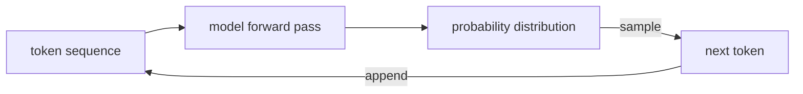
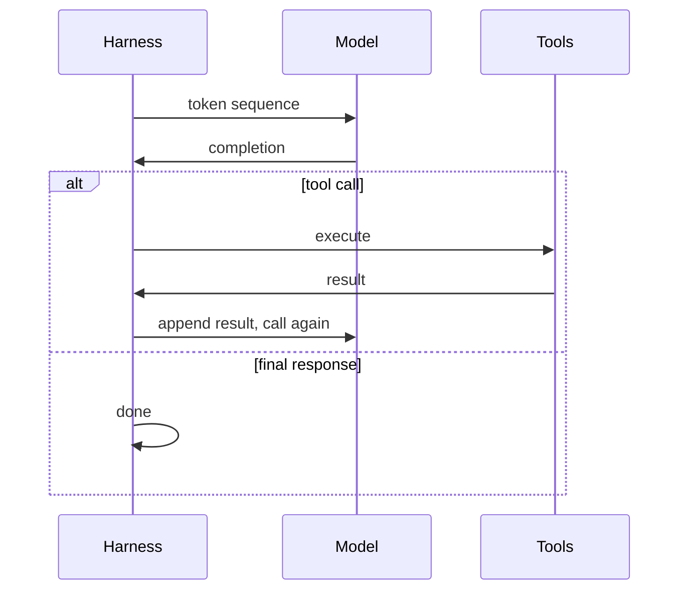
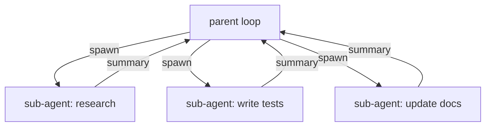

# AI Harnesses: The Layer That Makes Agents Actually Work

Most explanations of AI agents start from the top: here's what Claude Code does, here's the agentic loop, here are the tools. That's fine if you just want to use it. But if you want to understand why it works, and more importantly why it breaks, you need to start from the bottom.

So let's start from the bottom.

## What a model actually is

A language model is a function. You give it a sequence of tokens, it gives you a probability distribution over what token comes next.

```
f(t₁, t₂, ..., tₙ) → P(tₙ₊₁)
```

To generate text, you sample a token from that distribution, append it to the sequence, and call the function again. Repeat until you hit a stop token or a length limit.



Two things follow directly from this model.

**The function is stateless.** There is no hidden state carried between calls. What looks like memory is just the sequence getting longer. Every turn of a conversation, every instruction, every result — it all gets concatenated into one flat token sequence and fed in from scratch on every call.

**The function has no side effects.** It takes tokens in and returns a distribution over the next token. It cannot read a file. It cannot run a test. It cannot call an API. It produces tokens. Nothing else.

This is the foundation everything else builds on.

## Tool calls are structured text

So how does a model "call a tool"? It doesn't. Not directly.

What it does is produce text that looks like a tool call:

```json
{
  "tool": "read_file",
  "path": "src/auth/middleware.ts"
}
```

The model learned to produce outputs like this during training. It was reinforced for emitting structured tool calls when doing so led to better task completion downstream. The model itself isn't running anything — it's outputting tokens. The thing that parses that output and actually runs the tool is the harness.

This distinction matters. The model has no privileged access to your filesystem or shell. It just knows that outputting a certain structure tends to be followed (in training) by a result appearing in the sequence. It learned the pattern. The harness is what makes the pattern real.

## The execution loop

Here's the core of how an agentic system works:



The harness manages the loop. It builds the token sequence, calls the model, parses the output, and decides what happens next. If the output contains a tool call, it runs the tool, appends the result to the sequence, and calls the model again. If the output is a final response, it exits.

A chatbot runs this loop once. An agent runs it until the task is done or it gives up.

Everything Claude Code does — grep the codebase, read a file, run tests, read the failure, edit the file, run tests again — is this loop iterating. Each tool result is appended to the sequence. On every subsequent call, the model sees the full history: what it tried, what happened, where things stand now. The model isn't reasoning across time. It's reasoning over an ever-growing token sequence that contains its own prior actions.

## Context management is a hard constraint

Every call to the model has to fit inside a finite context window. Typically 128k to 200k tokens right now. That sounds like a lot until you're loading large source files, multiple rounds of tool output, error logs, and a long conversation history simultaneously.

The window fills up. When it does, something has to give.

Good harnesses make active decisions about what goes in the window:

- **What to load upfront:** project structure, relevant files, the task description
- **What to drop:** old turns, verbose outputs that already served their purpose
- **What to compress:** summarize long tool outputs instead of including them verbatim
- **What to fetch on demand:** retrieve content when it becomes relevant rather than preloading everything

The naive approach is to put everything in and hope it fits. This fails on any non-trivial task. Context management is one of the harder problems in building a reliable harness, and it's where a lot of production agent failures come from — not model quality, but the wrong things being in (or out of) the window at the wrong time.

## Sub-agents are nested loops

A sub-agent is the same execution loop running inside another loop.

The parent harness spawns a child with its own context window, its own system prompt, and possibly a restricted tool set. The child runs its task to completion and returns a result. The parent appends that result to its own sequence and continues.



Two practical benefits fall out of this structure.

**Context isolation.** Each sub-agent has its own window. If you're deep in a refactor and need to research a separate part of the codebase, spinning that off as a sub-agent keeps the research from eating into the refactor's context budget. The parent gets back a summary, not the full transcript.

**Parallelism.** Sub-agents can run concurrently. Three independent tasks run in three loops at the same time. The parent waits for all three, collects the results, and continues.

The tradeoff is cost: each sub-agent is its own set of model calls. And coordination gets harder as the task graph deepens. But for the right problems — exploratory research, parallel file editing, isolated reviews — the structure pays off.

## Why Claude Code feels different from the chat interface

The Claude Sonnet model at claude.ai and the one in my terminal are identical. Same weights, same training. The experience is completely different because the harness is completely different.

The chat interface runs the loop once. Prompt in, response out. If you ask it to find a bug in your auth middleware, it asks you to paste the code, tells you what's wrong, and writes a fix. Then you go copy it, drop it in the right file, run the tests, come back with the results. The legwork is yours.

Claude Code runs the loop until the task is done. It greps the codebase, reads the relevant files, makes the edit, runs the tests, reads the failure if it breaks, adjusts, tries again. I've watched it loop through a fix five or six times before getting it right. The model isn't smarter — it just has the full history of its own actions in context, and the harness keeps feeding it back in.

Same model. Different loop. Completely different product.

## Where agents actually break

Understanding this layer is useful for debugging. When an agent produces wrong or confused output, the failure is usually in the harness, not the model. Specifically:

- The wrong files were loaded into context
- The right files were there but got pushed out as the window filled
- A tool result wasn't appended correctly and the model never saw it
- The loop exited too early before the task was actually done
- Too much irrelevant content diluted what the model could attend to

Knowing this reframes the debugging question. Instead of "why did the AI get confused," you ask "what was in the context window at the point of failure." That's a much more tractable question.

The harness is most of the product. The model is what makes it work.
