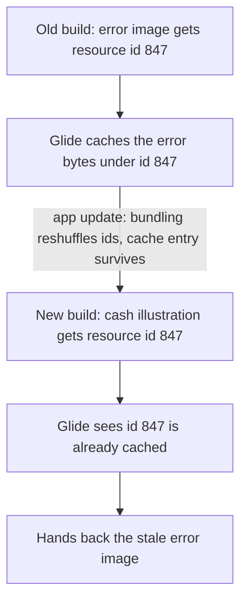

# The Image Cache Bug I Couldn't Reproduce

A few users saw the wrong picture on one screen. Where an illustration should have been, they got our generic error graphic — a coin with a sad face. Nothing was broken. The pixels were just wrong. And I couldn't reproduce it on my own phone.

It came down to one line in an open-source library.

## Three facts

- Only some users hit it.
- App updates didn't fix it.
- Clearing the app cache did.

Clearing the cache fixes it, so it's a cache problem. An app update should clear that kind of cache but didn't, so it's a stubborn one. And it's per-user, not in the code — I read the whole path and the screen asks for the right image every time.

## Android caches images by a number

We use expo-image, which runs on Glide underneath. Glide decodes an image once and files the result under a key. For a bundled image — one shipped inside the app — that key is the Android resource id. An integer like `2131165890`.

The catch: those ids are handed out at build time and aren't stable across builds. Add or remove a resource and the whole table gets renumbered. The id that meant "error image" in one build can mean "cash illustration" in the next.

## What changed

Right before the reports, we moved that illustration from being served over a CDN to being bundled in the app.

That's the whole trigger. A CDN image is cached by its URL — unique, can't collide. A bundled image is cached by that unstable integer. Bundling it dropped it into the filing system with reused ticket numbers, and it landed on an id that used to belong to the error image. The old error bytes were still sitting in the cache under that id.

Only people who'd installed the previous build had the poisoned entry. Fresh installs — and my phone — were fine.

## Why the update didn't help

Glide knows resource ids aren't stable, so expo-image stamps each cached resource with the app version to force a refresh when the version changes. Good idea. But the stamp only got applied to one URI scheme, `android.resource://`, and React Native's bundled images use a different one, `res:/`. expo-image even converts `res:/` a few lines earlier so Glide can load it — it just skipped the stamp on that path.

So the guard was there, commented, shipped, and doing nothing for the exact case it was written for. Fixed in expo-image 56 by stamping both schemes. Our stopgap was to skip the disk cache for bundled images entirely, which dodges the whole thing regardless of version.

Two things stuck. A content-addressed key can't have this bug — the CDN version was immune because the key *was* the content. And a guard can pass review, compile, and protect nothing if it watches the wrong input.
